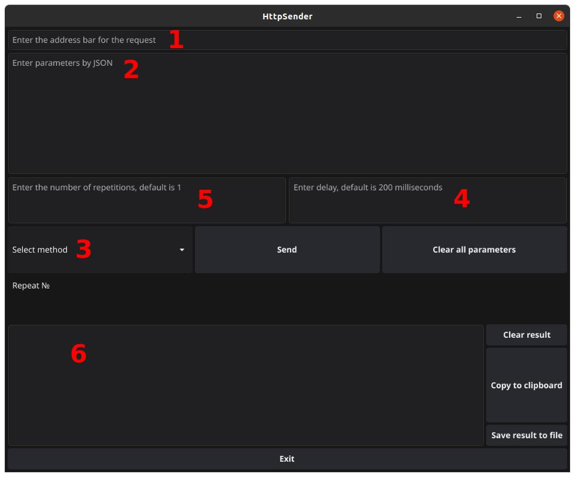

## HttpSenderDesktop

Simple desktop application, no registration or data storage, with a graphical interface for sending http requests. The main goal is local testing of developed applications.

Libraries used https://github.com/fyne-io/fyne, https://github.com/fyne-io/fyne-cross (for testing), https://github.com/golang-design/clipboard and others from the go standard library.

### Explanations:
1. The query string is sent as is, with GET parameters.
2. JSON with parameters
3. Menu with selection of request method. There is no default value.
4. Delay between requests (with a given repetition).
5. Number of request repetitions.
6. Outputting the answer. When repeated, data is added.

The buttons also have self-explanatory names.

